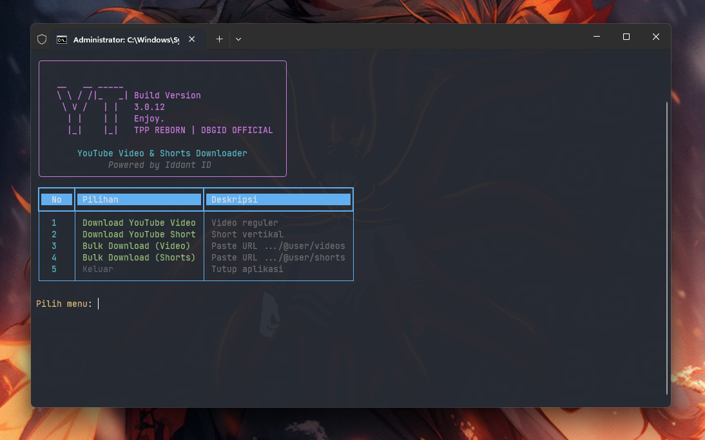
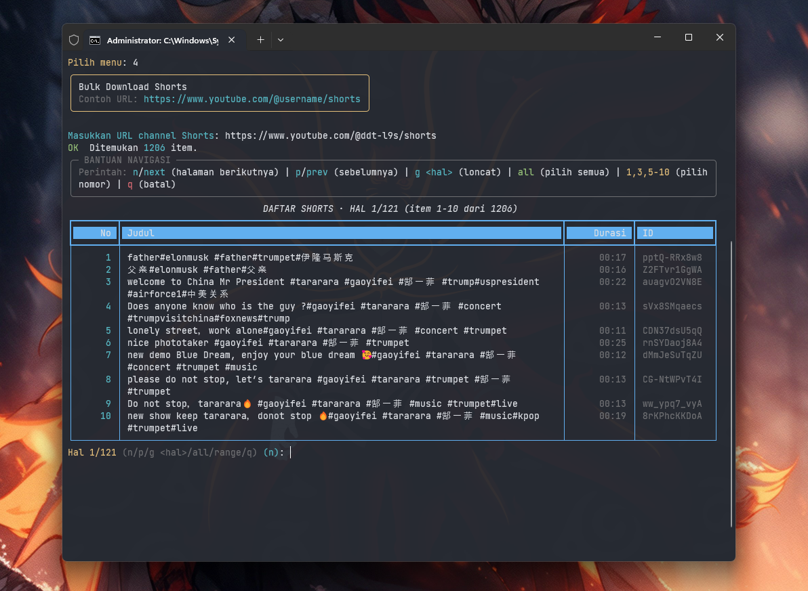
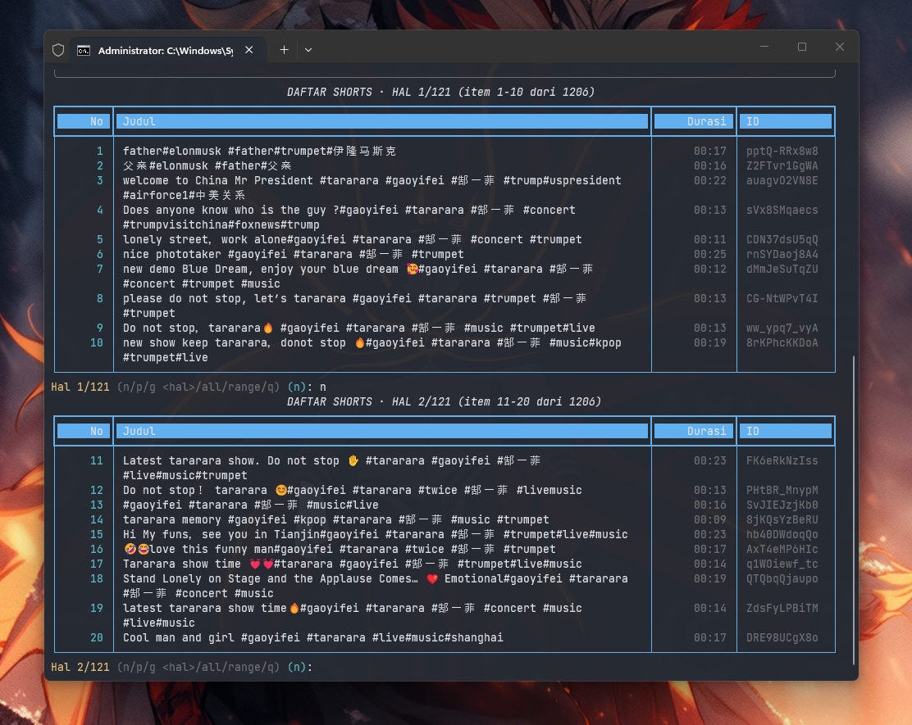
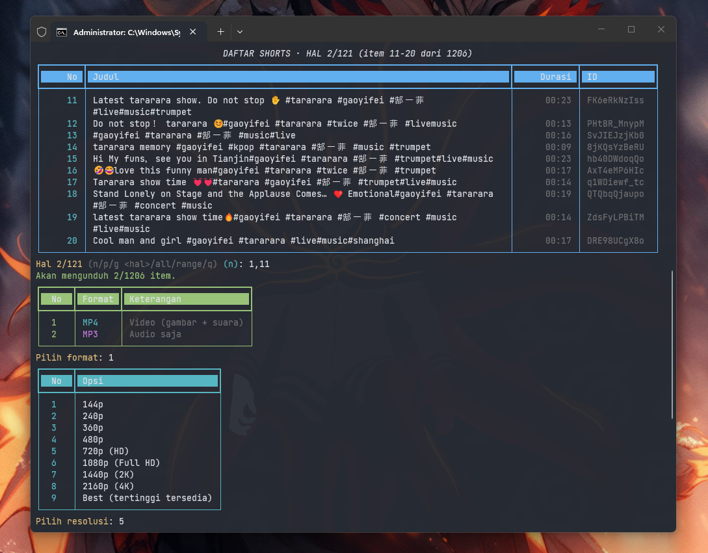
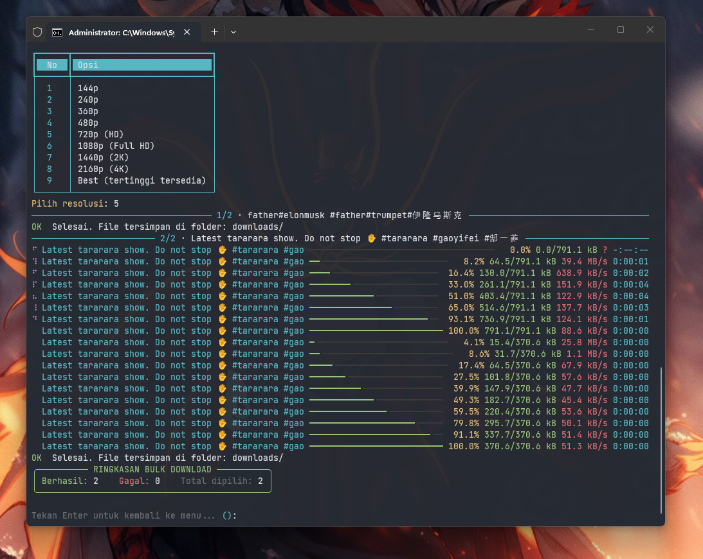

# YT Downloader

```
 __   __ _____
 \ \ / /|_   _|   Build Version
  \ V /   | |     3.0.12
   | |    | |     Enjoy.
   |_|    |_|     TPP REBORN | DBGID OFFICIAL
```

**YouTube Video & Shorts Downloader** — sebuah CLI sederhana berbasis Python untuk
mengunduh video dan Shorts dari YouTube ke dalam format **MP4** (berbagai resolusi)
atau **MP3** (berbagai bitrate). Tampilannya dipercantik dengan
[`rich`](https://github.com/Textualize/rich) (banner, tabel menu, dan progress bar),
sedangkan proses unduhnya menggunakan [`yt-dlp`](https://github.com/yt-dlp/yt-dlp).

> Powered by **Iddant ID**

---

[](https://www.python.org/)
[](https://github.com/yt-dlp/yt-dlp)
[](https://github.com/Textualize/rich)
[](https://ffmpeg.org/)
[](#-lisensi)


---


## Fitur
 
- **Download single Video** dari URL YouTube biasa
- **Download single Shorts** dari URL Shorts
- **Bulk Download Video** — paste `https://youtube.com/@user/videos`
- **Bulk Download Shorts** — paste `https://youtube.com/@user/shorts`
- **Listing berhalaman 10 item per page** — navigasi `n` / `p` / `g <hal>`
- **Seleksi fleksibel**: `all`, `1,3,5-10`, atau kombinasi nomor global
- **Durasi otomatis** di-fetch untuk halaman yang sedang tampil
- Pilih format **MP4** (video) atau **MP3** (audio)
- Resolusi **144p &rarr; 4K** atau **Best** untuk MP4
- Kualitas **128 / 192 / 256 / 320 kbps** untuk MP3
- UI terminal rapi pakai [`rich`](https://github.com/Textualize/rich): banner, tabel berwarna, progress bar, spinner
- Ringkasan **Berhasil / Gagal** di akhir bulk download

---

## Tampilan
### Menu Utama
 

 
### Bulk Download — Listing &amp; Pagination
 
Paste URL channel `/videos` atau `/shorts`, daftar tampil 10 per halaman, durasi otomatis terisi.
 

 
Ketik `n` untuk halaman berikutnya:
 

 
### Pilih Format &amp; Resolusi
 

 
### Progress Download &amp; Ringkasan
 

 
---

## Persyaratan

- **Python** 3.8 atau lebih baru
- **pip** (manajer paket Python)
- **FFmpeg** — wajib untuk:
  - menggabungkan video + audio saat mengunduh MP4 dengan resolusi tinggi,
  - mengkonversi audio ke MP3.

### Cek versi
```bash
python --version
pip --version
ffmpeg -version
```

---

## Instalasi

### 1. Clone repository
```bash
git clone https://github.com/ipkzone/YT-Downloader.git
cd YT-Downloader
```

### 2. (Opsional tapi disarankan) Buat virtual environment

**Linux / macOS**
```bash
python3 -m venv venv
source venv/bin/activate
```

**Windows (PowerShell)**
```powershell
python -m venv venv
.\venv\Scripts\Activate.ps1
```

### 3. Install dependencies Python
```bash
pip install -U yt-dlp rich
```

Atau, jika Anda membuat file `requirements.txt` berisi:
```
yt-dlp
rich
```
jalankan:
```bash
pip install -r requirements.txt
```

### 4. Install FFmpeg

**Windows**
1. Download dari https://www.gyan.dev/ffmpeg/builds/ (pilih `ffmpeg-release-essentials.zip`).
2. Ekstrak, lalu tambahkan folder `bin` ke **PATH** environment.
3. Verifikasi: `ffmpeg -version`.

**macOS (Homebrew)**
```bash
brew install ffmpeg
```

**Linux (Debian / Ubuntu)**
```bash
sudo apt update
sudo apt install -y ffmpeg
```

**Termux (Android)**
```bash
pkg update && pkg upgrade
pkg install python ffmpeg
pip install -U yt-dlp rich
```

---

## Cara Menjalankan

Dari direktori project, jalankan:
```bash
python yt-downloader.py
```

Anda akan disambut oleh banner dan menu utama:

```
1. Download YouTube Video    -> satu URL video reguler
2. Download YouTube Short    -> satu URL shorts
3. Bulk Download (Video)     -> paste URL .../@user/videos
4. Bulk Download (Shorts)    -> paste URL .../@user/shorts
5. Keluar
```

### Contoh URL
 
| Tipe | Contoh |
|---|---|
| Video tunggal | `https://www.youtube.com/watch?v=dQw4w9WgXcQ` |
| Shorts tunggal | `https://www.youtube.com/shorts/abcdEFGHijk` |
| Bulk Video (channel) | `https://www.youtube.com/@ddt-l9s/videos` |
| Bulk Shorts (channel) | `https://www.youtube.com/@ddt-l9s/shorts` |
 
---
 
## Navigasi Bulk Download
 
Saat daftar item dari channel tampil, gunakan perintah berikut di prompt halaman:
 
| Perintah | Aksi |
|:---:|---|
| `n` / `next` / **Enter** | Halaman berikutnya |
| `p` / `prev` | Halaman sebelumnya |
| `g 5` | Loncat ke halaman 5 |
| `all` | Pilih **semua** item (lintas halaman) |
| `1,3,5-10` | Pilih nomor tertentu (boleh lintas halaman) |
| `q` | Batal &amp; kembali ke menu |
 
> Nomor pada kolom **No** adalah **nomor global** (1 sampai total item), bukan nomor lokal per halaman. Jadi di halaman 2 (item 11&ndash;20), ketik `11,15` untuk pilih item nomor 11 dan 15.
 
### Contoh Flow
 
```
1. Pilih menu 4  -> Bulk Download (Shorts)
2. Paste URL     -> https://www.youtube.com/@ddt-l9s/shorts
3. Tampil 10 item/halaman, total 1206 item (121 halaman)
4. Ketik 'n' beberapa kali untuk lihat halaman berikutnya
5. Ketik '1,11' untuk pilih item nomor 1 dan 11
6. Pilih format MP4 -> resolusi 720p
7. Download berjalan dengan progress bar -> ringkasan otomatis
```
 
---
 
## Format &amp; Resolusi
 
### MP4 (Video)
 
| No | Resolusi |
|:---:|:---|
| 1 | 144p |
| 2 | 240p |
| 3 | 360p |
| 4 | 480p |
| 5 | 720p (HD) |
| 6 | 1080p (Full HD) |
| 7 | 1440p (2K) |
| 8 | 2160p (4K) |
| 9 | Best (tertinggi tersedia) |
 
### MP3 (Audio)
 
| No | Bitrate |
|:---:|:---|
| 1 | 128 kbps |
| 2 | 192 kbps |
| 3 | 256 kbps |
| 4 | 320 kbps (terbaik) |
 
File hasil download disimpan ke folder **`downloads/`** dengan format nama:
 
```
<Judul Video> [<videoID>].<ext>
```
 
---

---

## Troubleshooting

| Masalah | Solusi |
|---|---|
| `ERROR: yt-dlp belum terinstall` | Jalankan `pip install -U yt-dlp` |
| `ERROR: rich belum terinstall` | Jalankan `pip install -U rich` |
| MP3 / merge MP4 gagal | Pastikan **FFmpeg** sudah terinstall dan ada di **PATH** |
| Error format / resolusi tidak tersedia | Coba pilih **Best** atau resolusi yang lebih rendah |
| `HTTP Error 403 / 429` | Update `yt-dlp` ke versi terbaru: `pip install -U yt-dlp` |
| URL Shorts gagal dideteksi | Tetap pilih menu **Download YouTube Short** dan tempelkan URL lengkap `https://www.youtube.com/shorts/...` |

> **Tips:** YouTube sering mengubah format internalnya. Kalau tiba-tiba ada yang
> error, langkah pertama biasanya cukup `pip install -U yt-dlp`.

---

## Disclaimer

Tool ini ditujukan untuk **penggunaan pribadi / edukasi**. Pastikan Anda
mematuhi [Terms of Service YouTube](https://www.youtube.com/t/terms) dan hak
cipta konten yang Anda unduh. Pengguna bertanggung jawab penuh atas
penggunaan tool ini.

---


## Lisensi
 
```
Copyright (c) 2026 Iddant ID. All Rights Reserved.
 
Tool ini diperbolehkan dipakai dan dimodifikasi untuk
penggunaan pribadi non-komersial dengan tetap mencantumkan
kredit kepada pemilik asli (Iddant ID).
 
Dilarang menjual, mengubah merk, atau menghilangkan kredit
pada banner / kode tanpa izin tertulis dari pemilik asli.
 
Tool ini disediakan "AS IS" tanpa jaminan apapun.
```
 
---

## Credits

- Author: *Iddant ID*
- Library: [yt-dlp](https://github.com/yt-dlp/yt-dlp), [rich](https://github.com/Textualize/rich)
- Tooling: [FFmpeg](https://ffmpeg.org/)

